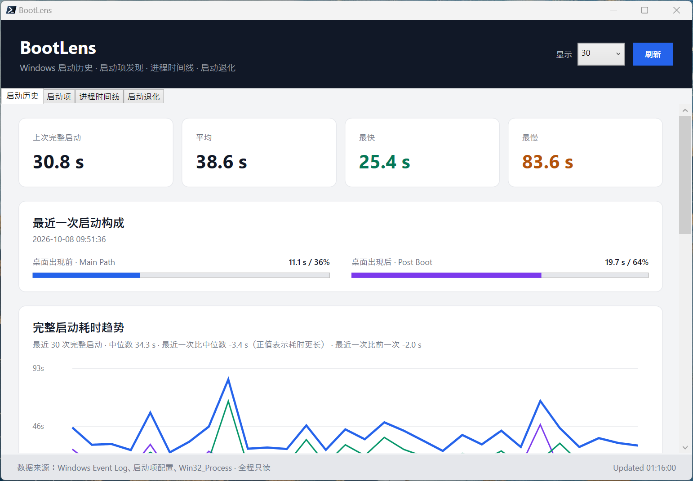

# BootLens

BootLens 是一个只读的 Windows 启动观察工具。它汇总 Windows 已记录的启动诊断数据、常见自动启动配置，以及扫描时仍在运行的进程信息，帮助你了解启动历史、启动项和启动相关诊断事件。BootLens 不驻留后台，也不会修改启动配置或系统设置。

<p align="center">
  
</p>

## 可以查看什么

| 页面 | 内容 | 使用时要知道 |
|---|---|---|
| **启动历史** | 已确认的完整启动记录、启动阶段耗时和最近启动趋势 | 只统计符合完整启动数据契约的记录；睡眠/休眠恢复及无法确认类型的记录不纳入 |
| **启动项** | Registry Run、Startup Folder、Scheduled Tasks、自动启动 Windows Services | 显示的是配置发现结果，不代表该项目实际运行，也不表示它造成了启动延迟 |
| **进程时间线** | 扫描时仍在运行的进程、进程创建时间及其相对启动锚点的偏移 | 是当前进程快照，不包含已经退出的进程；需要管理员权限读取完整信息 |
| **启动退化** | Windows Diagnostics-Performance Event ID 101 记录及其启动关联和目标匹配情况 | 展示 Windows 的原始诊断指标，不等于某个程序造成的启动延迟；需要管理员权限 |

## 快速开始

### 运行要求

- Windows
- PowerShell 7（`pwsh.exe`）；这是当前使用和验证的 PowerShell 版本。
- 无需安装第三方 PowerShell 模块。

查看完整数据时，建议以**管理员身份**打开 Windows Terminal 或 PowerShell 7。GUI 和 CLI 都可以从项目目录启动：

```powershell
Set-Location "<BootLens 项目目录>"
.\bootlens-gui.ps1
```

例如，项目位于 `E:\LearnToCode\shell\BootLens` 时：

```powershell
Set-Location "E:\LearnToCode\shell\BootLens"
.\bootlens-gui.ps1
```

启动后，使用顶部标签切换页面；可用右上角的“显示”选择记录数量，点击“刷新”重新读取数据。进程时间线和启动退化数据在首次打开对应页面时读取。

普通权限下，启动项页面可能只能读取当前用户有权限查看的配置；启动历史、进程时间线或启动退化数据可能不可用。要查看完整数据，请从管理员权限的 PowerShell 7 启动 GUI 或 CLI。

## GUI 页面使用方法

### 启动历史

查看最近完整启动的时间、总耗时、Main Path 和 Post Boot，并通过趋势图和摘要比较样本。更改“显示”数量后，列表、趋势和摘要会按所选样本数更新。点击“刷新”重新读取。

### 启动项

查看发现的自动启动配置。可按来源筛选，也可用搜索框查找名称或目标。页面提供配置来源、作用域、解析状态和启用/启动状态，不会替你禁用或修改项目。

### 进程时间线

页面列出扫描时仍在运行的进程，并显示 PID、父 PID、进程创建时间、Boot Offset 和可执行文件路径。选择一行可查看完整路径和详情，再次选择该行可收起详情。列表可在表格内滚动；滚到表格顶部或底部后可继续滚动页面。

Boot Offset 是进程创建时间相对最近完整启动锚点的时间差，不是进程自身启动耗时。由于时间戳来源和测量精度不同，锚点之前可能出现小幅负值。

### 启动退化

页面按行显示 Windows Event ID 101 诊断记录，包括启动时间、目标、匹配等级和 Windows 报告的退化值。选择一行可展开事件原始字段、事件路径及关联信息；再次选择该行可收起详情。

目标匹配只是事件目标与当前启动项配置之间的线索。即使路径精确匹配，也不能据此认定该程序导致启动变慢；当前配置也未必等于事件发生时的历史配置。

## 命令行用法

在 PowerShell 7 中进入项目目录后运行脚本。需要完整数据时，请使用管理员权限的 PowerShell 7。

### 查看启动历史和趋势摘要

```powershell
# 默认查看最近 30 次确认的完整启动
.\bootlens.ps1

# 查看最近 10 次启动
.\bootlens.ps1 -Count 10

# 输出 JSON，便于后续处理
.\bootlens.ps1 -Count 30 -AsJson
```

常用参数：`-Count` 控制返回的启动样本数（1–100）；`-ScanEvents` 控制扫描的诊断事件数（1–1000）；`-AsJson` 输出 JSON。

### 发现启动项

```powershell
# 查看所有来源
.\bootlens-startup.ps1 -Source All

# 只查看计划任务来源
.\bootlens-startup.ps1 -Source ScheduledTask

# 输出配置中的原始命令行或来源详情
.\bootlens-startup.ps1 -Source All -ShowCommand

# 输出 JSON
.\bootlens-startup.ps1 -AsJson
```

`-Source` 可选 `All`、`RegistryRun`、`StartupFolder`、`ScheduledTask` 或 `WindowsService`。`-ShowCommand` 可能显示包含用户名、参数或其他敏感信息的命令行，分享输出前请先检查。

### 查看当前运行进程

```powershell
# 查看最早创建的 50 条进程记录
.\bootlens-processes.ps1 -Count 50

# 输出 JSON
.\bootlens-processes.ps1 -Count 100 -AsJson
```

常用参数：`-Count` 控制文本表格显示数量（1–1000）；`-ScanEvents` 控制寻找完整启动锚点时扫描的诊断事件数（1–1000）；`-OperationTimeoutSec` 设置读取操作超时（1–120 秒）；`-AsJson` 输出 JSON。此命令同样只记录扫描时仍在运行的进程。

## 如何理解结果

- **完整启动**：BootLens 交叉验证 Windows 启动事件后才纳入统计。已确认的 Restart 和完整关机后启动可以纳入；Fast Startup、睡眠/休眠恢复及无法确认类型的记录不纳入。判定细节见 [BootRecord 数据契约](docs/boot-record.md)。
- **Main Path**：Windows 报告的桌面出现前主要启动阶段耗时。
- **Post Boot**：Windows 报告的桌面出现后的启动阶段耗时。
- **Average / Median / Fastest / Slowest**：所选启动样本的平均值、中位数、最快值和最慢值。样本数量较少时，单次异常会明显影响摘要。
- **Windows 退化标记**：Event ID 100 提供的 Windows 标记，不解释具体原因，也不归责于某个应用。
- **Event ID 101 退化值**：Windows 报告的原始指标。`TotalTime` 和 `DegradationTime` 是不同字段，BootLens 不将它们相加或相减来推导应用造成的延迟。
- **匹配等级**：`Exact path` 表示路径与当前发现的启动项一致；`App family candidate` 表示名称相符但路径不同；`Generic host` 表示如 `svchost.exe` 的通用宿主；`Ambiguous / Unmatched` 表示候选不唯一或没有可靠匹配。匹配不代表因果关系。
- **Unknown / 数据不可用**：表示系统未提供该值、读取权限不足或无法可靠确认。BootLens 会保留未知状态，不猜测缺失数据。

## 常见问题

**页面显示数据不可用或权限提示**

关闭当前 GUI，以管理员身份打开 PowerShell 7，然后从项目目录重新运行 `.\bootlens-gui.ps1`。启动项页面仍可能显示当前账户可读取的配置。

**启动历史样本少于所选数量**

显示数量是上限。BootLens 只返回系统中仍可读取、且通过完整启动校验的记录；不符合条件的事件不会当作启动样本。

**进程列表中有 Unknown 路径或负 Boot Offset**

Windows 可能不允许读取部分进程的时间戳或路径。负偏移可能来自时间戳精度差异；该字段是相对时间，不代表异常启动耗时。

## 数据定义与进一步阅读

- [BootRecord：完整启动记录](docs/boot-record.md)
- [StartupItem：启动项发现](docs/startup-item.md)
- [Process Timeline：进程时间线](docs/process-timeline.md)
- [Boot Trend：启动趋势](docs/boot-trend.md)
- [Diagnostic Observation：Windows 诊断观察](docs/diagnostic-observation.md)
